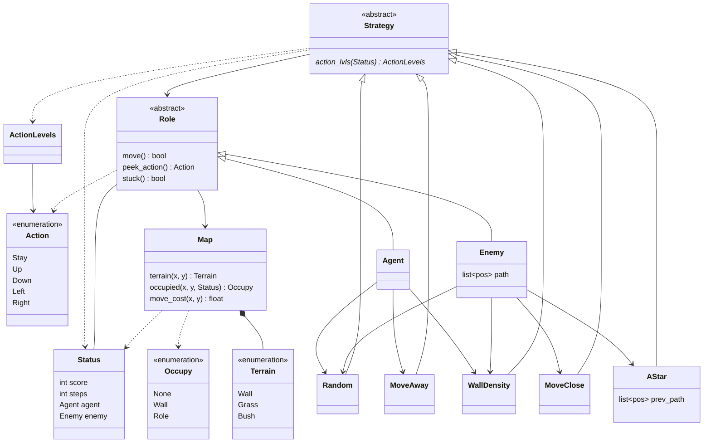

# Chase AI

[](https://www.python.org)


## Introduction


An artificial intelligence game to demonstrate the ***A\* path-finding***. The enemy will try to get close to the agent and make it stuck between walls.

## Getting Started

### Prerequisites

- Install [*Python 3.11*](https://www.python.org).

- Install all dependencies.

  ```bash
  pip install -r requirements.txt
  ```

### Running

```bash
python main.py
```

### Configurations

The game configuration is in the `src/config.json` file.

## Documents

See `docs/wiki.md` for the details.

### Class Diagram



## Dependencies

- [*pygame*](https://www.pygame.org)

## License

Distributed under the *MIT License*. See `LICENSE` for more information.

The image resources are from the book "*Making Games with Python & Pygame*" written by *Al Sweigart*.
