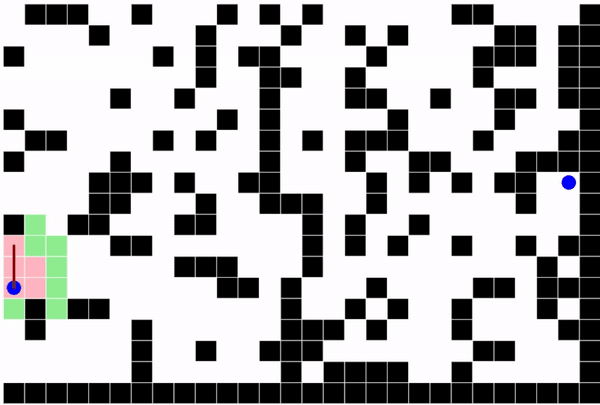

# A* Path-Finding



You can change default configurations in `main.js`.

```javascript
const CONFIG = {

    //! Whether diagonal move is allowed.
    diagonalMove: true,

    //! The probability of generating a wall.
    wallThreshold: 0.3,

    /**
     * The estimate function.
     *
     * @warning It must be always optimistic - real time will be this or longer.
     */
    heuristic: (src, dest) => {
        if (this.diagonalMove) {
            return dist(src.x, src.y, dest.x, dest.y);
        } else {
            return Math.abs(src.x - dest.x) + Math.abs(src.y - dest.y);
        }
    },

    //! Use a slower frame rate to see how it is working.
    //! e.g. 2 or 5;
    frameRate: null
};
```

Use the following evaluation function to make *A\** turn into *Dijkstra's* Algorithm:

```javascript
(src, dest) => 0
```

Or use this to find a long path from the source to the target:

```javascript
(src, dest) => {
    if (this.diagonalMove) {
        return -dist(src.x, src.y, dest.x, dest.y);
    } else {
        return -Math.abs(src.x - dest.x) + Math.abs(src.y - dest.y);
    }
}
```