# Chase AI

[](https://www.python.org)


## Introduction

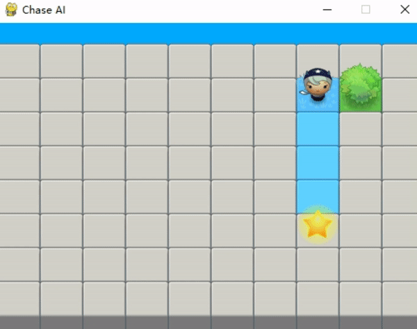

An artificial intelligence game to demonstrate the ***A\* path-finding***. The enemy will try to get close to the agent and make it stuck between walls.

## Getting Started

### Prerequisites

- Install [*Python 3.11*](https://www.python.org).

- Install all dependencies.

  ```bash
  pip install -r requirements.txt
  ```

### Running

```bash
python main.py
```

### Configurations

The game configuration is in the `src/config.json` file. There are some important options.

- The probability (density) of different terrains.

  ```json
  "terrainProb": {
      "wall": 0.25,
      "bush": 0.2
  },
  ```

- The move cost of different terrains.

  ```json
  "moveCost": {
      "grass": 1,
      "bush": 10
  },
  ```

- The strategy weight for different roles.

  ```json
  "strategyWeights": {
      "agent": {
          "random": 1
      },

      "enemy": {
          "random": 0.2,
          "moveClose": 0.3,
          "aStar": 1
      }
  }
  ```

## Class Diagram

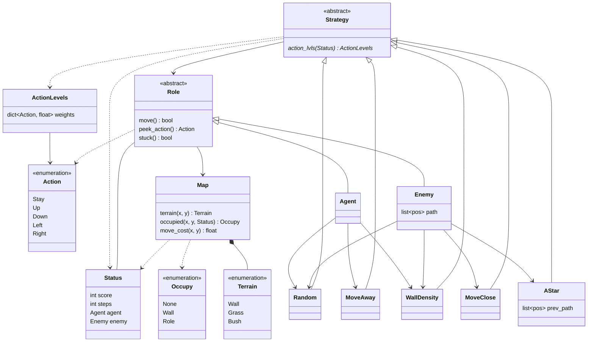

## Terrains

There are three kinds of terrains: ***grass***, ***bush***, ***wall***. They have different move costs and features.

- *Grass*

  

  A grass tile has 1 unit of move cost by default.

- *Bush*

  

  A bush tile has 10 units of move cost by default.

  If a role moves onto a bush tile, it will be trapped and ***lose the next move chance***.

- *Wall*

  

  

  A wall tile cannot be passed through.

When a role moves, it will consider the cost of different terrains and avoid bushes, as the *blue* path shows.

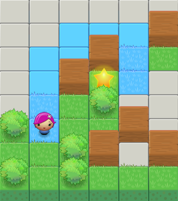

### Black Fog

At first, the enemy knows *nothing* about terrains except its current position. The terrain of the complete map will be displayed according to the enemy's exploration. Unknown tiles are displayed as below:


The movement might fail because of occupation or invalid positions. The enemy can get the cause of failure and ***memorize terrains***. Some action strategies can use terrain information.

```python
class Occupy(Enum):
    # No occupation.
    NONE = auto()
    # The position is invalid.
    INVALID = auto()
    # The position is a wall.
    WALL = auto()
    # The position is occupied by a role.
    ROLE = auto()
```

## Strategies

It's a key design to a role's behavior. A `Strategy` is a kind of logic to determine the ***next action*** according to the game status.

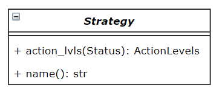

The `name` method returns the strategy name used in the `src/config.json` file.

The `action_lvls` method returns an array containing the level of recommendation for every action.

Assume:

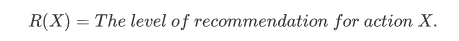

Then `action_lvls` returns:

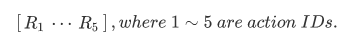

I have implemented five kinds of strategies. They can be ***combined*** together.

### Random Move

`Random` is the default strategy. All valid actions except *stay* will get ***random*** recommendation levels.

### Move Away & Move Close

`MoveAway` and `MoveClose` only consider the ***next one step***. They use the following estimate function to maximize or minimize the distance between the agent and enemy.

```python
def dist(src: tuple[int, int], dest: tuple[int, int]) -> float:
    return abs(src[0] - dest[0]) + abs(src[1] - dest[1])
```

### Wall Density

`WallDensity` tries to find a direction where the ***density*** of walls is lower.

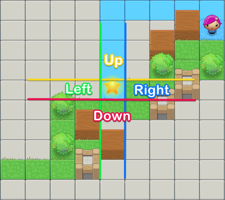

### A* Search

`AStar` tries to find the shortest path from the enemy to the agent, as the *blue* path shows.

At first, the enemy knows nothing about terrains, so `AStar` assumes that all tiles are ***grass*** and finds an ***ideal*** path.

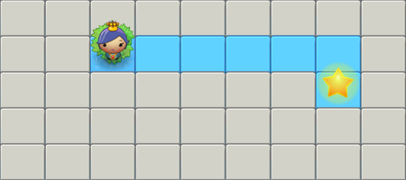

After the enemy learns terrains from its movements, `AStar` will become more accurate.

## Strategy Weights

A role can combine more than one strategy and the importance of each strategy is represented by its ***weight***. The role uses *weighted addition* to get the final action.

Assume:

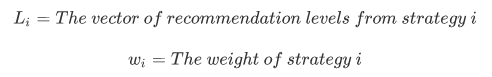

Then the final level of recommendation for each action is:


The role will choose the action with the ***highest*** value.

## Test Statistics

All tests have the following fixed options:

```json
"maxSteps": 500,

"mapSize": {
    "height": {
        "min": 25,
        "max": 25
    },

    "width": {
        "min": 25,
        "max": 25
    }
},

"terrainProb": {
    "wall": 0.3,
    "bush": 0.1
},

"moveCost": {
    "grass": 1,
    "bush": 15
},
```

And the agent and enemy will be randomly generated in the left half and right half of the map.

### The Agent

When testing the agent, the enemy's strategy weights are fixed as below:

```json
"enemy": {
    "random": 0.1,
    "aStar": 1,
    "moveClose": 0.2,
    "wallDensity": 0.1
}
```

The agent's strategy weights are changed in each trial.

| Test ID |                Strategy Weights                 |
| :-----: | :---------------------------------------------: |
|    1    |                    [1, 0, 0]                    |
|    2    |                    [1, 1, 1]                    |
|    3    | [1, 0 ~ 0.4, 0 ~ 0.4]. It changes in each step. |
|    4    |   [1, 0 ~ 1, 0 ~ 1]. It changes in each step.   |

> The order of weights is `Random`, `MoveAway`, `WallDensity`.

The game runs 100 times in each trial and the agent's scores are shown below:

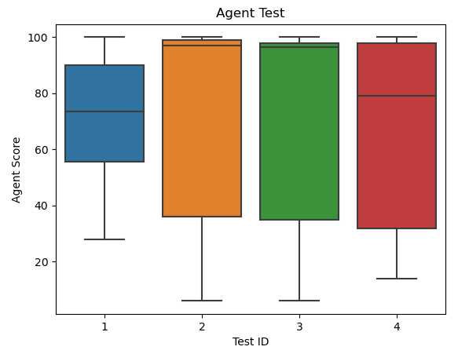

### The Enemy

When testing the enemy, the agent's strategy weights are fixed.

```json
"agent": {
    "random": 0.1,
    "moveAway": 0.4,
    "wallDensity": 0.4
}
```

The enemy's strategy weights are changed in each trial.

| Test ID |  Strategy Weights  |
| :-----: | :----------------: |
|    1    |    [1, 0, 0, 0]    |
|    2    | [0.5, 0, 0.7, 0.9] |
|    3    |    [0, 1, 0, 0]    |
|    4    | [0.1, 1, 0.2, 0.1] |

> The order of weights is `Random`, `AStar`, `MoveClose`, `WallDensity`.

The game runs 100 times in each trial and the agent's scores are shown below:

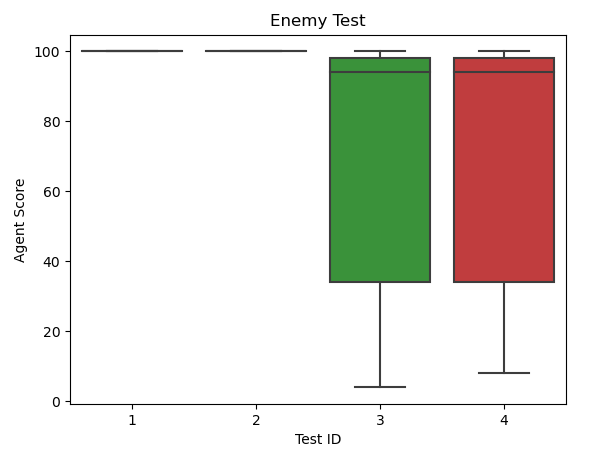

## Dependencies

- [*pygame*](https://www.pygame.org)

## License

Distributed under the *MIT License*. See `LICENSE` for more information.

The image resources are from the book "*Making Games with Python & Pygame*" written by *Al Sweigart*.